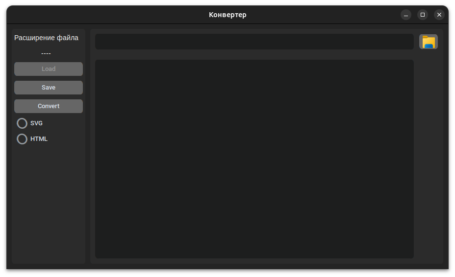
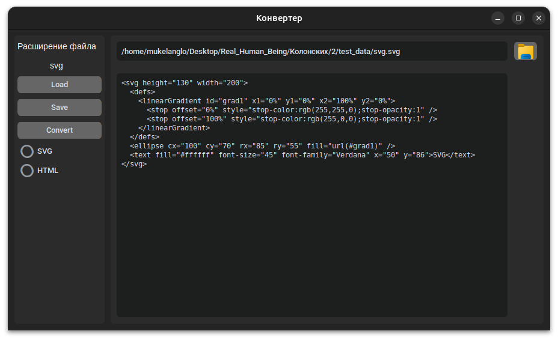
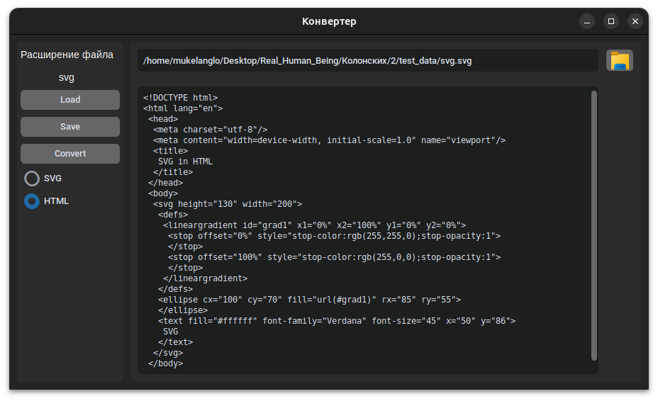

# Лабораторная работа №2
### Работа с файлами `svg, html`
Этот проект представляет собой удобный конвертер и редактор файлов форматов `svg` и `html`.


## Содержание
- [Технологии](#Технологии)
- [Начало работы](#Использование)
- [Тестирование](#Тестирование)


## <a name="Технологии">Технологии</a> 
- [Custom Tkinter](https://customtkinter.tomschimansky.com/)
- [Python](https://www.python.org/)

## <a name="Использование">Начало работы</a> 
Расскажите как установить и использовать ваш проект, покажите пример кода:

Создайте виртуальное окружение и активируйте его с помощью команд:
- Для Windows:
    ```sh
    python -m venv venv
    source venv\Scripts\activate
    ```
- Для Linux:
    ```sh
    python3 -m venv venv
    source venv/bin/activate
    ```
Установите все зависимости:
```sh
pip install -r requirements.txt
```
Запустите файл `main.py`:
```sh
python main.py
```

## <a name="Тестирование">Тестирование</a> 
Для тестирования нужно выбрать любой файл по кнопке в верхнем правом углу, затем нажать `Load`.

Теперь вы можете редактировать открытый файл в поле с текстом.

Для конвертации текста в поле, нужно выбрать опцию конвертации и нажать `Convert`.

После конвертации и редактирования можно сохранить файл в любое место с правильным расширением, нажав кнопку `Save`.



## Команда проекта
#### [Каранинский Михаил](https://github.com/MuKeLaNGlo)
#### [Валитов Радик](https://github.com/Radik3451)